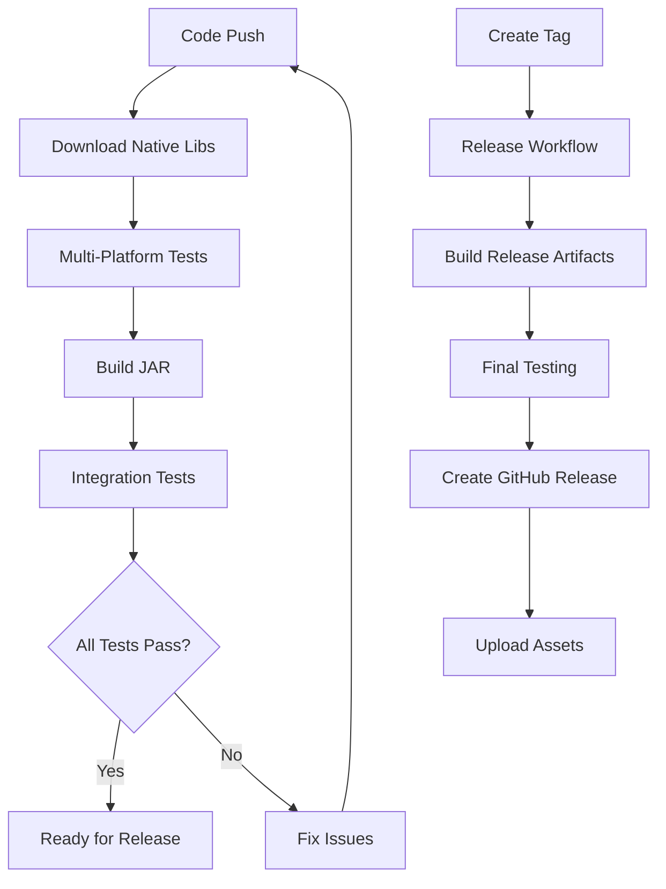

# Fast Image Java - Testing Guide

This document describes the testing strategy and GitHub workflows for the Fast Image Java library.

## 🧪 Test Overview

The test suite is designed to verify functionality across different platforms and architectures, focusing on correctness rather than performance.

### Test Classes

1. **FastImageUtilsTest** - Core functionality tests
   - Library initialization and platform detection
   - Basic compression functionality
   - Quality level testing (30%, 50%, 70%, 90%)
   - Preset quality methods (high, medium, low)
   - Input validation and error handling
   - JPEG format validation

2. **CrossPlatformTest** - Platform compatibility tests
   - Platform detection accuracy
   - Native library loading verification
   - Cross-platform result consistency
   - Multi-quality compression validation
   - Error handling consistency

3. **QuickBenchmark** - Performance testing (excluded from CI)
   - Performance comparison with JDK ImageIO
   - Benchmark suite for different image sizes
   - Manual execution only

## 🚀 GitHub Workflows

### Build and Test (`build-and-test.yml`)

**Trigger**: 
- Automatic: Push to main/master/develop, Pull requests
- Manual: GitHub Actions page with test mode selection

**Test Modes**:
- **Full** (default): Complete CI/CD pipeline with all steps
- **Functional Only**: Skip JAR building and integration tests  
- **Build Only**: Skip integration tests

**Features**:
- Downloads native libraries from fast-image releases
- Tests on multiple platforms (Linux, Windows, macOS x86_64/ARM64)
- Cross-platform compatibility verification
- Builds JAR with embedded native libraries
- Integration testing with built artifacts

**Jobs**:
1. `download-native-libs` - Downloads and organizes native libraries
2. `test-cross-platform` - Runs tests on each platform
3. `build-jar` - Creates JAR with native libraries included (skipped in functional-only mode)
4. `integration-test` - Tests the final JAR on each platform (skipped in functional-only and build-only modes)

**Usage Examples**:
```bash
# Quick functional testing during development
# GitHub -> Actions -> Build and Test -> Run workflow -> Select "Functional Only"

# Full pipeline for release preparation  
# Automatically triggered on push to main, or manually select "Full"

# Build verification only
# Manually select "Build Only" to test packaging without integration tests
```

## 🛠️ Running Tests Locally

### Prerequisites

1. Java 8 or higher
2. Maven 3.6+
3. Native libraries (downloaded automatically by workflows)

### Test Commands

```bash
# Run all functional tests
mvn clean test

# Run only FastImageUtils tests
mvn test -Dtest=FastImageUtilsTest

# Run only cross-platform tests  
mvn test -Dtest=CrossPlatformTest

# Run performance benchmark (manual)
mvn test -Dtest=QuickBenchmark

# Or use the benchmark profile
mvn test -Pbenchmark
```

### Manual Native Library Setup

If you need to set up native libraries manually:

```bash
# Create resources directory
mkdir -p src/main/resources/native

# Download and extract native libraries
curl -L -o fast-image-all-platforms.tar.gz \
  "https://github.com/lihongjie0209/fast-image/releases/download/v0.2.1/fast-image-all-platforms.tar.gz"

tar -xzf fast-image-all-platforms.tar.gz

# Copy native libraries
find . -name "*.dll" -o -name "*.so" -o -name "*.dylib" | \
  xargs -I {} cp {} src/main/resources/native/
```

## 🎯 Platform Support

| Platform | Architecture | Library File | Status |
|----------|--------------|--------------|---------|
| Windows | x86_64 | `fast_image-windows-x86_64.dll` | ✅ Supported |
| Windows | aarch64 | `fast_image-windows-aarch64.dll` | ✅ Supported |
| Linux | x86_64 | `libfast_image-linux-x86_64.so` | ✅ Supported |
| Linux | aarch64 | `libfast_image-linux-aarch64.so` | ✅ Supported |
| macOS | x86_64 | `libfast_image-macos-x86_64.dylib` | ✅ Supported |
| macOS | aarch64 | `libfast_image-macos-aarch64.dylib` | ✅ Supported |

## 📊 Test Strategy

### Functionality Focus
- Tests prioritize correctness over performance
- Verify library initialization across platforms
- Validate compression output format and quality
- Ensure consistent error handling

### Platform Independence
- Tests designed to work regardless of native library availability
- Graceful degradation when libraries cannot be loaded
- Platform-specific behavior validation

### Error Scenarios
- Null and empty input validation
- Invalid quality parameter handling
- Unsupported format detection
- Library loading failure recovery

## 🔧 Troubleshooting

### Common Issues

1. **Native library not found**
   ```
   java.lang.RuntimeException: Failed to load Fast Image native library
   ```
   - Ensure native libraries are in `src/main/resources/native/`
   - Check platform detection matches available libraries
   - Verify file permissions

2. **Tests skipped**
   ```
   org.junit.AssumptionViolatedException: Native library not available
   ```
   - Expected behavior when libraries can't load
   - Tests use JUnit assumptions to skip gracefully

3. **Platform detection issues**
   - Check `System.getProperty("os.name")` and `System.getProperty("os.arch")`
   - Verify platform mapping in `FastImageUtils.detectPlatform()`

### Debug Information

Add this to see platform detection details:
```java
System.out.println(FastImageUtils.getPlatformInfo());
```

## 📈 CI/CD Pipeline



## 📝 Release Process

1. **Prepare Release**
   - Update version in `pom.xml`
   - Ensure all tests pass
   - Update documentation

2. **Create Release**
   - Create and push git tag: `git tag v1.0.0 && git push origin v1.0.0`
   - Or trigger manual release via GitHub Actions

3. **Verify Release**
   - Check GitHub release page
   - Download and test artifacts
   - Verify all platforms tested

## 🤝 Contributing

When adding new tests:

1. Follow existing test patterns
2. Use JUnit assumptions for optional features
3. Include platform-specific validation
4. Add comprehensive error handling tests
5. Update this documentation

## 📚 Additional Resources

- [Fast Image Rust Library](https://github.com/lihongjie0209/fast-image)
- [Maven Surefire Plugin](https://maven.apache.org/surefire/maven-surefire-plugin/)
- [GitHub Actions Documentation](https://docs.github.com/en/actions)
